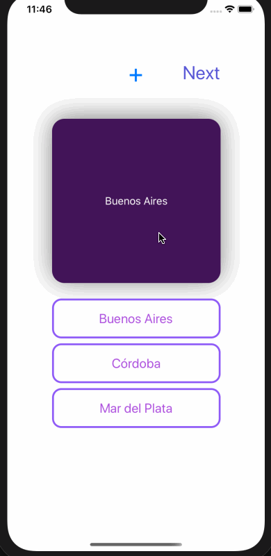

## Zoe Offermann Flashcard App

## Lab 3

### App Description
You can view flashcards with multiple choice answers. You can add many cards and these cards will save to disk and will be accessible if the app is reloaded.

### App Walk-though
 

## Required
- [x] User can browse through multiple flashcards
- [x] User can re-open the app and see previously created flashcards
- [x] Push code to GitHub
## Optional
- [x] User can store multiple choice questions
- [ ] User can delete a flashcard
- [ ] User can edit existing flashcard

